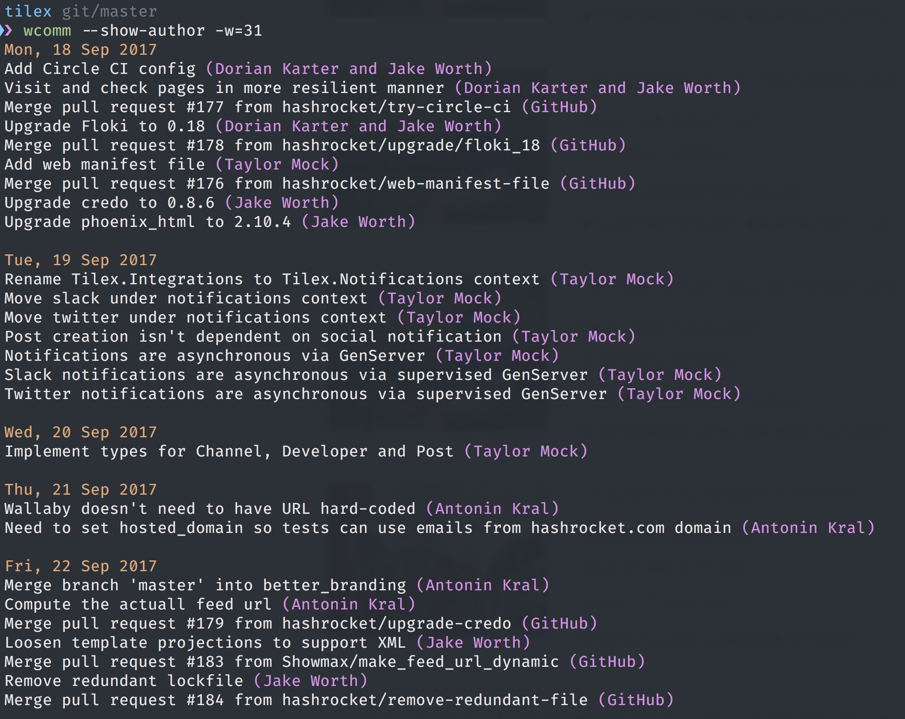

[](https://travis-ci.org/dkarter/weekly_commits)

WeeklyCommits is a command line tool for getting a bird's eye view of your
commits on a branch for a specific week.

It is particularly helpful for stand ups, filling up detailed time sheets and
for recap when starting up again after a long weekend.

## Installation

```ruby
gem 'weekly_commits'
```

And then execute:

    $ bundle

Or install it yourself as:

    $ gem install weekly_commits

## Usage

For help type:

```sh
wcomm help
# or
wcomm help weekly_commits
```

Usage documentation from command-line:

```
Usage:
  wcomm

Options:
  -w, [--week=N]                                 # Relative week number. e.g. -w=1 for last week. 0 = current week.
                                                 # Default: 0
      [--show-author], [--no-show-author]        # Display author(s) with each commit message. e.g. Did stuff (Ghost Ninja)
      [--sort=SORT]                              # Show commits in ascending/descending order. Default: older commits on top, newer on bottom.
                                                 # Default: desc
                                                 # Possible values: asc, desc
```

To use the gem, navigate to a repo and make sure you have the WeeklyCommits gem
installed for that version of ruby in that directory.

Make sure you are on the correct branch.

By default WeeklyCommits will only show commits on the current branch.

### Example

Show me this week's commits:

```sh
wcomm
```

Show me last week's commits:

```sh
wcomm -w=1
```

Show me commits from two weeks ago including author

```sh
wcomm -w=2 --show-author
```

### Screenshots



## TODO

- [ ] Add support for specifying a branch explicitly

## Contributing

Bug reports and pull requests are welcome on GitHub at
https://github.com/dkarter/weekly_commits.


## License

The gem is available as open source under the terms of the [MIT
License](http://opensource.org/licenses/MIT).

